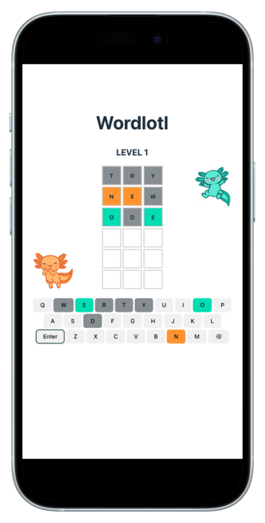
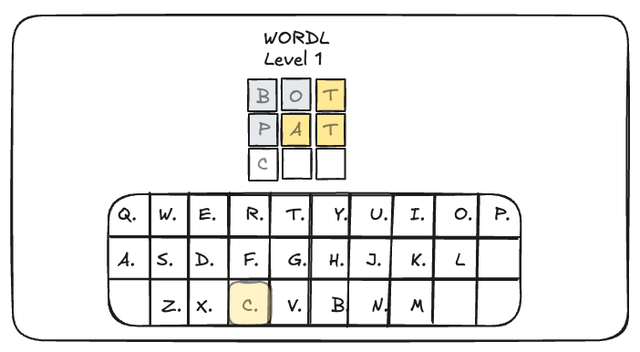
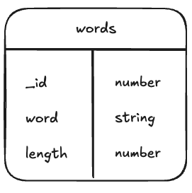
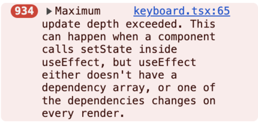
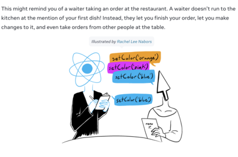

# Wordlotl



## User Story

A user that enjoys a daily challenge and is looking to build strategic mindset, quick mental warm-up and vocabulary practice.

### Solution:

Create a fun word-guessing game with multiple levels.

### Acceptance Criteria:

Users should be able to:

- Multi-level: Start at 3-letter words, each correct level ups the length by 1 (up to 13 letters)
- Six attempts per level; game over on the sixth wrong guess
- Color feedback:
  - 🟩 Correct (letter & position)
  - 🟨 Present (letter in word, wrong position)
  - ⬜ Absent (letter not in word)
- Responsive UI: Works on desktop and mobile
- Touch & type keyboard support
- Supabase-backed word lookup for dynamic word lists.

## Wireframes

#### Desktop



#### SQL Table



## Technologies Used

- React: the app uses embedded javascript to render information on the page
- React router: the app uses routner to setup a route of the game page
- Typescript: the app uses typescript due to its enhancement being the addition of static typing
- Node & Express: the app has its own server, built using Express
- MVC Pattern: the app uses the Model View Controller (MVC) programming design pattern
- Supabase/PostgreSQL: the app persists data via a relational database
- Mongoose: to model and query data in MongoDB through Node
- Tailwind.css: The app is efficiently well-designed and considers user experience and usability
- Postman: to test server requests
- Dotenv: to load environment variables from .env file
- Vite: for a fast modern development environment
- Vitest: testing framework (Jest support for ECMAScript Modules is still experimental)
- React testing library: to write unit tests for React components (works on top of react-dom which was already included)

## Approach taken

1. Created project brief
2. Constructed wireframes to gain an understanding of the flow of the app.
3. Drew out schema for word database
4. Set up the team Trello board with a list of steps to completion for SCRUM
5. Created team Github Org for Github Flow workflow
6. Forked project from [Axolotl-56](https://github.com/Scratch-Project-Axolotl-56/New-Scratch_Project)
7. Started local server
8. Created model, controller, and route architecture
9. Tested requests in PostMan
10. Updated React component logic
11. Created unit tests

## Major Coding Win

**1. Component logic:** Updating keyboard state for color feedback and resetting on a new level:

```js
  useEffect(() => {
    const handleLetterUpdate = (
      guessLetters: string[],
      stautsArr: string[]
    ): void => {
      const newKeyStates = { ...keyStates };
      guessLetters.forEach((key, i) => {
        newKeyStates[key] = stautsArr[i];
      });

      setKeyStates(newKeyStates);
    };

    const handleKeyboardReset = (): void => {
      const newKeyStates = Object.keys(keyStates).reduce((acc, key) => {
        acc[key] = 'default';
        return acc;
      }, {} as MyDynamicObject);
      setKeyStates(newKeyStates);
    };

    if (guesses.length) {
      const guessLetters: string[] = guesses[guesses.length - 1].split('');
      const statusArr: string[] = [];
      guessLetters.map((letter, i) => {
        if (targetWord[i] === letter.toLowerCase()) {
          statusArr.push('correct');
        } else if (targetWord.includes(letter.toLowerCase())) {
          statusArr.push('present');
        } else {
          statusArr.push('attempted');
        }
      });
      handleLetterUpdate(guessLetters, statusArr);
    } else {
      handleKeyboardReset();
      return;
    }
  }, [
    guesses,
    targetWord,
  ]);
  /* Note: adding keyStates to the dependency array will create a circular dependency that leads to an infinite loop */
```

**2. Component unit testing:** Mocking Supabase client import with the word "cat"

```js
vi.mock('../../../supabaseClient', () => ({
  supabase: {
    from: () => ({
      select: () => ({
        eq: () => Promise.resolve({ data: [{ words: 'cat' }], error: null }),
      }),
    }),
  },
}));
```

**3. Connecting to DB via frontend:**

Used `useEffect` and `createClient` from `@supabase/supabase-js` to fetch words array from Supabase on the front-end. This sets the target word in the state.

## Technical Challenges

- Michael
  - Testing with Vitest
  - Mocking fetch result in unit test of game component
  - Determining asynchronicity in unit tests
- Jonathan
  - accessing environment variables across files
  - connecting backend database to frontend
- Lisa
  - debugging an unfamiliar codebase
  - resolving typescript errors
  - updating react state of a nested array/object
  - useEffect lint errors causing stack overflow when resolved
    - 
  - react batching causing only the last letter's color to be updated in a turn
    - 

## Installation Instructions

1. Run `npm install` in root folder to install all necessary dependencies listed in the package.json
2. Since we have another package.json in our client side, `cd client` and run `npm install` again to install all necessary dependencies required for client files. Use command `cd ..` to be in the correct project level.
3. Create a `.env` file in the root. You'll need to have a `VITE_SUPABASE_URL` to connect to your Supabase, which can be found in Supabase project setting's Data API, and a `VITE_SUPABASE_ANON_KEY`, which can be found in Supabase project setting's API keys to configure API keys to securely control access to the project. Be sure to turn off RLS setting in your own table setting.
4. To launch the app locally run `npm run dev` from the root folder and navigate to **localhost:5173** in your browser.

## Unsolved Problems

- a user can submit invalid words to the game
- sideEffect: if a user last clicked a letter then presses the enter key, that letter will be the first entry of the next row

## Next Steps

- words already attempted should not be submitted again
- invalid words should not be submitted
- add more unit tests
